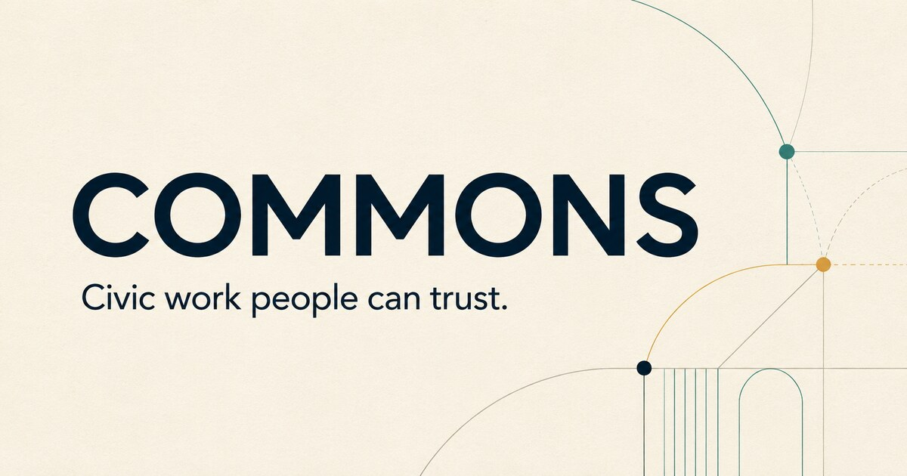
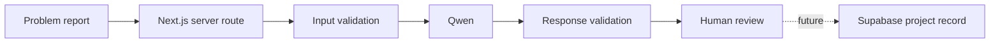

# COMMONS

COMMONS helps communities turn a local problem into a clear, reviewable project plan. A user describes an issue, Qwen organizes the report into a draft, and the user reviews the suggested objective, tasks, measurements, and evidence requirements.



Built for the Alibaba Cloud AI Hackathon Pakistan 2026.

## Current version

The repository currently includes:

- A responsive public website with light and dark themes
- A validated civic problem submission form
- A protected server route for Qwen plan generation
- Structured AI output checked with Zod
- Clear timeout, retry, configuration, and invalid-response handling
- Supabase schema and security migrations
- Unit and route tests for the planning flow

The generated plan is a draft, not a verified project. Saving projects, authentication, task collaboration, KPI entry, evidence review, and Impact Passport generation are not connected to the interface yet.

## How it works

1. A user enters a title, description, location, and optional image link.
2. The server validates the submission before contacting Qwen.
3. Qwen returns a structured draft with an objective, affected groups, tasks, KPIs, and evidence requirements.
4. The response is validated again before it reaches the interface.
5. The user reviews the draft. Project creation remains disabled until persistence is implemented.

COMMONS keeps unknown measurements as `null`. It does not turn missing data into zero, estimate progress, or treat uploaded evidence as verified.

## Technology

- Next.js 16 and React 19
- TypeScript
- Qwen through Alibaba Cloud Model Studio
- Supabase PostgreSQL, Auth, and Storage foundations
- Zod validation
- Vitest and Testing Library
- Tailwind CSS 4

## Architecture



## Project structure

```text
src/
|-- app/
|   |-- api/ai/plan/       # Qwen planning route
|   |-- projects/          # Project registry and workspace states
|   |-- submit/            # Civic problem submission
|-- components/            # Shared layout, form, and UI components
|-- lib/
|   |-- ai/                # Prompt, schema, service, and typed errors
|   |-- auth/              # Authentication helpers
|   |-- db/                # Supabase clients
|   |-- validation/        # Submission validation
|-- __tests__/             # Unit and route tests
supabase/migrations/       # Database schema and security rules
public/                    # Public assets
```

## Local setup

Requirements:

- Node.js 20 or newer
- npm
- Alibaba Cloud Model Studio API key
- Supabase project credentials for database features

```bash
git clone https://github.com/Syedsaadhhh/COMMONS-ALIBABA.git
cd COMMONS-ALIBABA
npm ci
cp .env.example .env.local
npm run dev
```

Open `http://localhost:3000` after the development server starts.

## Environment variables

```bash
NEXT_PUBLIC_SITE_URL=
DASHSCOPE_API_KEY=
DASHSCOPE_MODEL=qwen-plus
DASHSCOPE_BASE_URL=https://dashscope-intl.aliyuncs.com/compatible-mode/v1
NEXT_PUBLIC_SUPABASE_URL=
NEXT_PUBLIC_SUPABASE_ANON_KEY=
SUPABASE_SERVICE_ROLE_KEY=
```

Keep real credentials in `.env.local`. Environment files and private keys are ignored by Git and must not be committed.

## Commands

```bash
npm run dev        # Start the development server
npm run typecheck  # Check TypeScript
npm run lint       # Run ESLint
npm run test       # Run the test suite
npm run build      # Create a production build
npm run start      # Start the production server
```

## Team

| Team member | Role |
|---|---|
| Syed Saad | Technical Lead and Project Strategy |
| Areeba Muhammad | Product and Operations Lead |
| Mustafa Ahmed | Presentation and Pitch Lead |
| Urwa Rashid | Research and Project Support |
