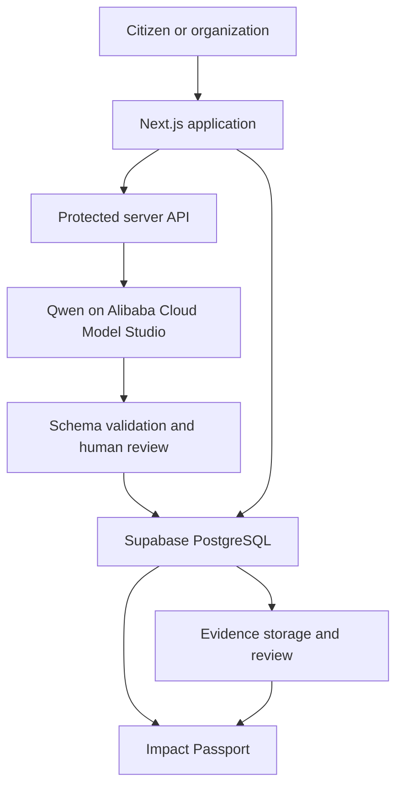

<div align="center">

# COMMONS

### From civic problems to measurable outcomes

**Problem to Project to Proof**

[](https://www.alibabacloud.com/)
[](#current-build-status)
[](https://www.alibabacloud.com/en/solutions/generative-ai/qwen)
[](https://nextjs.org/)
[](https://supabase.com/)

COMMONS is a cloud based civic collaboration platform. It helps a community turn a reported problem into a clear project, track the work, measure the result, and show the evidence behind it.

</div>

## Project status

COMMONS is in the build phase for the Alibaba Cloud AI Hackathon Pakistan 2026.

The product scope, user journey, technical architecture, data model, safety rules, and delivery plan are complete. Application development is now starting. This README separates completed planning from features that are still being built.

## Why we are building COMMONS

Civic work often starts in the wrong place. A serious local problem may first appear in a WhatsApp message, an email, a complaint form, or a PDF. People discuss it, but the next steps are not clear. Tasks are not assigned. Measurements are not agreed on. Evidence is collected late, or not at all.

This creates four common problems:

| Problem | What happens |
|---|---|
| Reports are unstructured | Important details are missed |
| Ownership is unclear | People do not know who should act next |
| Progress is hard to measure | Activity is reported as impact |
| Evidence is disconnected | Results are difficult to trust |

COMMONS gives citizens, community groups, public institutions, businesses, and volunteers one shared place to plan and track a civic project.

## What COMMONS does

A user explains a civic problem in normal language and can also add a location and image. Qwen helps turn that report into a structured draft with:

- A short problem statement
- The people affected
- Relevant stakeholders
- A clear objective
- Suggested tasks and milestones
- KPIs that should be measured
- Evidence that should be collected

The user reviews the draft before creating the project. Nothing becomes an official project record until a person confirms it.

After confirmation, the project is saved in a shared workspace. Team members can assign tasks, record measurements, upload evidence, review that evidence, and create an Impact Passport.

## The first complete demo

We are not trying to build a huge government portal during the hackathon. Our goal is to finish one complete and reliable user journey.

The first demo is based on this report:

> "The street beside our school floods after heavy rain and blocks students and residents."

The user journey is:

1. A citizen submits the flooding report.
2. Qwen returns a structured project draft.
3. The user checks and edits the draft.
4. COMMONS saves the confirmed project.
5. Contributors receive tasks and deadlines.
6. The team records KPI measurements and their sources.
7. Contributors upload evidence linked to the work.
8. A reviewer accepts, rejects, or questions the evidence.
9. COMMONS creates an Impact Passport from the saved records.

This use case is only the first demonstration. The same process can later support waste management, water access, road safety, education, health, and other community problems.

## Core MVP

| Area | What must work |
|---|---|
| Problem submission | Save a title, description, location, and optional image |
| AI planning | Call Qwen through a protected server route and receive valid structured data |
| Human review | Let the user edit the AI draft before creating a project |
| Project workspace | Save projects, members, tasks, KPIs, and activity |
| Task management | Assign an owner, deadline, and status |
| KPI tracking | Store baseline, current value, target, unit, and source |
| Evidence | Upload a file, create a hash, link it to the project, and review it |
| Impact Passport | Show measured change and accepted evidence |
| Failure states | Clearly show when AI, evidence, or measurement is unavailable |

## Important product rules

These rules are part of the product, not just notes for the demo.

### AI helps with structure

Qwen can suggest a plan, but it cannot decide that a claim is true. Every generated plan stays editable until a person confirms it.

### Missing data stays missing

If a KPI has no current measurement, COMMONS will show it as unmeasured. It will not turn missing data into zero, an estimated percentage, or a success claim.

### Uploading evidence does not verify it

Evidence follows a review process:

`SUBMITTED -> UNDER_REVIEW -> ACCEPTED, REJECTED, or CLARIFICATION_REQUIRED`

### The Impact Passport comes from records

The final passport is built from saved tasks, KPI measurements, accepted evidence, and audit events. It is not a free form AI summary.

## Technical architecture



### Technology stack

| Layer | Choice | Why we chose it |
|---|---|---|
| Frontend and server | Next.js with TypeScript | Keeps the user interface and protected API routes in one codebase |
| AI planning | Qwen through Alibaba Cloud Model Studio | Fits the hackathon and supports structured model responses |
| Validation | JSON Schema and runtime checks | Stops malformed AI output from creating bad records |
| Database | Supabase PostgreSQL | Gives us a relational database for connected project data |
| Authentication | Supabase Auth | Supports user accounts and project membership |
| File storage | Supabase Storage | Stores project evidence with controlled access |
| File integrity | SHA-256 | Creates a content fingerprint for each evidence file |
| Deployment | Vercel | Provides a direct deployment path for the Next.js application |
| Testing | Unit, integration, and end to end tests | Checks calculations, permissions, persistence, and failure handling |

## AI data contract

The AI planning route will return a predictable object. A shortened example is shown below.

```json
{
  "problemSummary": "Flooding blocks access beside a school.",
  "affectedGroups": ["students", "residents", "nearby businesses"],
  "objective": "Create and measure a local response plan.",
  "tasks": [
    {
      "title": "Document the affected locations",
      "ownerRole": "community contributor",
      "status": "not_started"
    }
  ],
  "kpis": [
    {
      "name": "Flooding incidents affecting access",
      "unit": "incidents per month",
      "baseline": null,
      "current": null,
      "target": null,
      "measurementMethod": "time stamped incident log"
    }
  ],
  "evidenceRequirements": [
    "Location photographs",
    "Drainage inspection record",
    "Incident log before and after action"
  ]
}
```

The null values are intentional. Qwen can suggest what should be measured, but the team must provide the real measurements.

## Data model

| Entity | Purpose |
|---|---|
| `users` | Contributors and reviewers |
| `projects` | Confirmed civic projects |
| `project_members` | Membership and project roles |
| `tasks` | Work, owners, deadlines, and status |
| `kpis` | Metric definitions and targets |
| `kpi_measurements` | Values, dates, and measurement sources |
| `evidence` | File details, hash, contributor, and project link |
| `evidence_reviews` | Review decision and notes |
| `audit_events` | History of important project actions |

Supabase row level security will limit protected changes to authorized project members.

## Impact Passport

The Impact Passport is the final output of a COMMONS project. It should answer:

1. What problem did the project address?
2. Who took part?
3. What work was completed?
4. What was measured?
5. What changed?
6. What accepted evidence supports the result?

The outcome may be improvement shown, no improvement shown, or insufficient measurement. Showing uncertainty is better than claiming a result that the data cannot support.

## Delivery plan

| Date | Main target |
|---|---|
| 28 Aug | Repository, project setup, data schema, landing page, and problem form |
| 29 Aug | Qwen integration, response validation, and plan review |
| 30 Aug | Project creation and database persistence |
| 31 Aug | Dashboard, tasks, roles, and activity history |
| 1 Sep | KPI definitions, measurements, calculations, and unmeasured states |
| 2 Sep | Evidence upload, hashing, links, and reviewer decisions |
| 3 Sep | Impact Passport, deployment, permissions, and system testing |
| 4 Sep | Final fixes, demo data, recorded walkthrough, and presentation |

## Current build status

| Workstream | Status |
|---|---|
| Product vision and problem definition | Complete |
| MVP scope and user journey | Complete |
| Architecture and product rules | Complete |
| Repository and technical README | Complete |
| Next.js application | Planned |
| Qwen integration | Planned |
| Supabase database | Planned |
| KPI and evidence workflows | Planned |
| Impact Passport | Planned |
| Deployment and test results | Planned |

This table will be updated as code is added.

## Planned repository structure

```text
commons/
|-- app/
|   |-- api/
|   |-- projects/
|   |-- submit/
|-- components/
|-- lib/
|   |-- ai/
|   |-- auth/
|   |-- db/
|   |-- validation/
|-- supabase/
|   |-- migrations/
|-- tests/
|-- public/
|-- .env.example
|-- README.md
```

## Local setup

These commands will apply after the Next.js project is committed.

```bash
git clone https://github.com/Syedsaadhhh/COMMONS-ALIBABA.git
cd COMMONS-ALIBABA
npm install
cp .env.example .env.local
npm run dev
```

Expected environment variables:

```bash
DASHSCOPE_API_KEY=
NEXT_PUBLIC_SUPABASE_URL=
NEXT_PUBLIC_SUPABASE_ANON_KEY=
SUPABASE_SERVICE_ROLE_KEY=
```

API keys and service credentials must not be committed.

## Definition of done

The MVP is complete when a judge can:

- Submit the flooding report
- Receive a real, schema valid Qwen project draft
- Edit and confirm the draft
- Refresh the page and see the saved project
- Assign and update a task
- Record a KPI measurement with a source
- Upload evidence and complete a review decision
- Generate an Impact Passport from saved records
- See a clear failure state when AI or measurement data is unavailable

## Team

COMMONS is led by Syed Saad and Areeba Muhammad. The wider team owns the pitch, research, testing, and delivery together.

| Team member | Role | Main responsibility |
|---|---|---|
| **Syed Saad** | Technical Lead and Project Strategy | Overall project guidance, system architecture, backend development, Qwen integration, database, deployment, and technical quality |
| **Areeba Muhammad** | Product and Operations Lead | Product decisions, civic workflow, frontend coordination, quality assurance, documentation, submission, and team coordination |
| **Mustafa Ahmed** | Presentation and Pitch Lead | Pitch story, presentation deck, demo flow, speaking preparation, and final delivery |
| **Urwa Rashid** | Research and Project Support | Civic research, use case validation, supporting content, testing help, and project assistance |

All four members will take part in final testing, demo preparation, and the regional round presentation.

## What we will show the judges

The project will be judged through the working product, not this README alone. Our final demonstration will focus on:

- A complete journey from problem report to Impact Passport
- A real Qwen API call with validated structured output
- Data that remains saved after refresh
- Clear user roles and permissions
- KPI values linked to measurement sources
- Evidence with an explicit review state
- Honest handling of missing data and service failures

<div align="center">

## COMMONS

**Turn concern into coordination. Turn activity into evidence. Turn evidence into measurable outcomes.**

Built for the Alibaba Cloud AI Hackathon Pakistan 2026.

</div>
