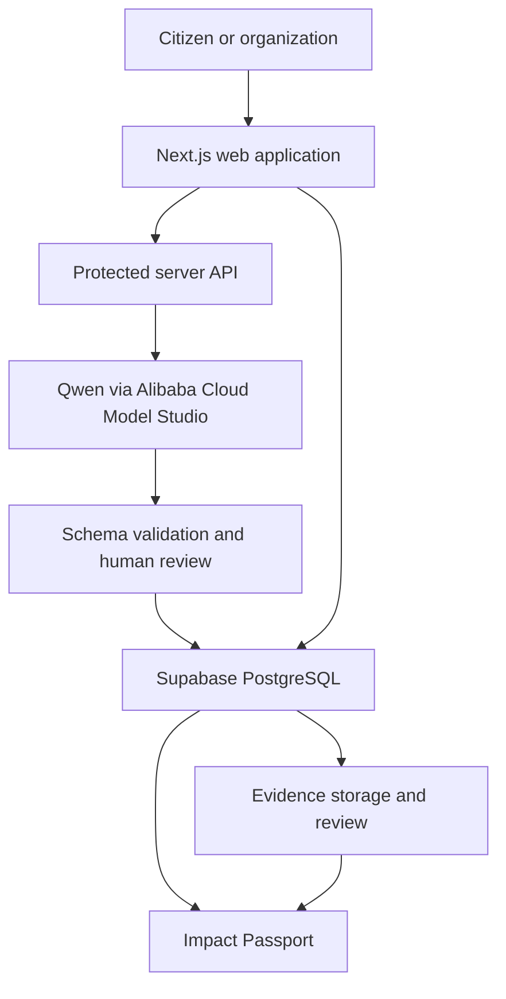
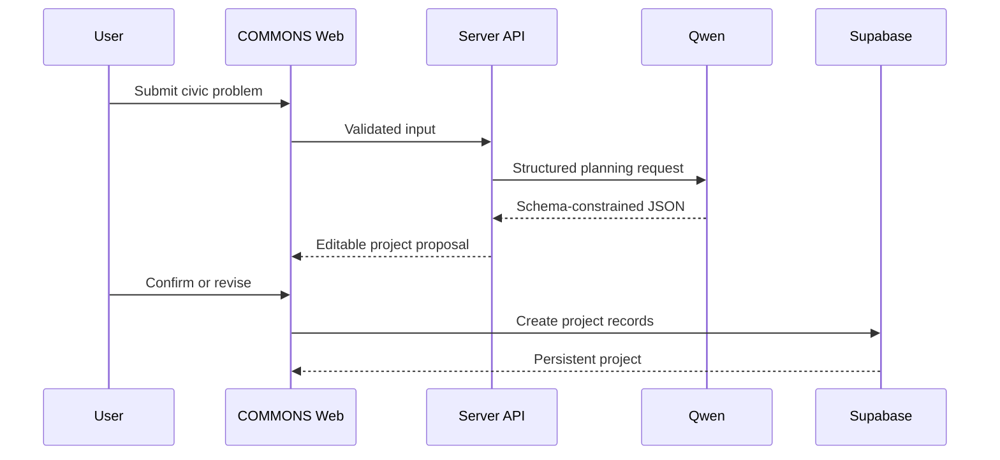

<div align="center">

# COMMONS

### From civic problems to measurable outcomes.

**Problem → Project → Proof**

[](https://www.alibabacloud.com/)
[](#build-status)
[](https://www.alibabacloud.com/en/solutions/generative-ai/qwen)
[](https://nextjs.org/)
[](https://supabase.com/)

*A cloud-native civic collaboration platform that transforms an unstructured community issue into an actionable project, measurable KPIs, reviewed evidence, and a transparent Impact Passport.*

[Vision](#the-vision) · [User Journey](#one-complete-user-journey) · [Architecture](#technical-architecture) · [Delivery Plan](#delivery-plan) · [Build Status](#build-status)

</div>

---

> [!IMPORTANT]
> COMMONS is currently in the **hackathon build phase**. This repository begins with the validated product scope and technical specification. Features marked as planned are not presented as completed. Working code, deployment links, and test evidence will be added as implementation progresses.

## The vision

Civic problems rarely fail because nobody cares. They fail because the path from concern to coordinated, measurable action is fragmented.

A flooded street may begin as a WhatsApp message. A broken water line may become an unread email. A community proposal may remain inside a PDF. Even when people respond, responsibilities, measurements, evidence, and accountability are often spread across disconnected tools.

**COMMONS creates one shared path from a reported problem to verifiable progress.**

It brings together:

- Citizens who experience and report problems
- Community organizations coordinating local action
- Public institutions responsible for services
- Businesses, donors, and experts contributing resources
- Reviewers and decision-makers evaluating results

## The problem

Today, civic initiatives commonly suffer from four gaps:

| Gap | Consequence |
|---|---|
| Unstructured reporting | Important context is lost across messages, forms, and documents |
| Unclear ownership | Stakeholders cannot see who is responsible for the next action |
| Weak measurement | Activity is mistaken for impact because KPIs are undefined or unmeasured |
| Unverifiable outcomes | Success claims are disconnected from reviewed evidence |

COMMONS addresses these gaps without pretending that AI can independently verify reality. AI helps structure the work; people confirm the plan, submit measurements, and review evidence.

## The solution

A user describes a civic problem in everyday language and optionally provides a location and image. COMMONS AI converts that input into a structured project proposal containing:

- A concise problem statement
- Affected groups and relevant stakeholders
- A measurable objective
- Suggested milestones and tasks
- KPI definitions and measurement requirements
- Evidence needed to demonstrate progress

The user reviews and edits the proposal before creating the project. The confirmed plan becomes a persistent workspace where contributors can manage tasks, record measurements, submit evidence, and generate an Impact Passport based only on stored project records.

## One complete user journey

The hackathon MVP focuses on a single end-to-end journey rather than disconnected feature screens.

1. **Report** — A citizen or organization submits a civic problem, location, and optional image.
2. **Structure** — Qwen returns a schema-constrained project proposal.
3. **Review** — A human confirms or edits the AI-generated plan.
4. **Coordinate** — The approved plan becomes a project with contributors, tasks, owners, and deadlines.
5. **Measure** — The team records KPI baseline, current value, target, unit, and measurement source.
6. **Evidence** — Contributors upload time-stamped evidence linked to a task or KPI.
7. **Verify** — A reviewer accepts, rejects, or requests clarification on evidence.
8. **Publish** — COMMONS creates an Impact Passport from measured KPIs and accepted evidence.

### Demonstration scenario

The first reference journey uses a recurring street-flooding problem:

> “The street beside our school floods after heavy rain, blocking students and residents.”

COMMONS should transform this report into a reviewable plan with relevant stakeholders, drainage-inspection tasks, a measurement approach, and evidence requirements. Any example figures shown during development will be labeled as demonstration data—not real-world impact.

## Core MVP

| Capability | What must work |
|---|---|
| Problem intake | Capture a title, description, location, and optional image |
| AI project structuring | Return validated JSON through a protected Qwen API route |
| Human confirmation | Allow edits before any project records are created |
| Persistent workspace | Store projects, members, tasks, KPIs, and activity |
| Task coordination | Assign owners, deadlines, and status |
| KPI engine | Track baseline → current → target without inventing missing values |
| Evidence workflow | Upload, hash, link, and review evidence |
| Impact Passport | Summarize measured change and accepted evidence |
| Failure handling | Show explicit retry, unmeasured, or inconclusive states |

## What makes COMMONS different

### 1. AI produces structure, not truth

Qwen accelerates planning by converting a messy civic report into structured data. Its suggestions remain editable and cannot automatically become verified project facts.

### 2. “Unmeasured” is a valid state

COMMONS never converts missing KPI data into 0%, estimated progress, or a success claim. A KPI remains unmeasured until a source-backed measurement is recorded.

### 3. Evidence has a review lifecycle

Evidence is not counted as verified simply because a file was uploaded. It moves through explicit states:

`SUBMITTED → UNDER_REVIEW → ACCEPTED / REJECTED / CLARIFICATION_REQUIRED`

### 4. The Impact Passport is derived, not generated

The passport is assembled from stored tasks, measurements, accepted evidence, and audit events. AI does not invent the final outcome.

## Technical architecture



### Technology choices

| Layer | Technology | Reason |
|---|---|---|
| Web application | Next.js + TypeScript | One codebase for UI and protected server routes |
| AI planning | Qwen through Alibaba Cloud Model Studio | Hackathon-aligned model access with structured-output support |
| Validation | JSON Schema + runtime validation | Prevent malformed AI responses from creating records |
| Database | Supabase PostgreSQL | Relational persistence for linked civic project data |
| Authentication | Supabase Auth | User identity and project membership |
| File storage | Supabase Storage | Evidence objects with controlled access |
| Integrity | SHA-256 | Content fingerprint for uploaded evidence |
| Deployment | Vercel | Fast, reproducible Next.js deployment |
| Testing | Unit, integration, and end-to-end tests | Prove calculations, permissions, persistence, and failure states |

### Request flow



## AI output contract

The planning API will return data shaped like the following:

```json
{
  "problemSummary": "Recurring flooding blocks access beside a school.",
  "affectedGroups": ["students", "residents", "nearby businesses"],
  "stakeholders": [
    {
      "name": "Municipal drainage team",
      "reason": "Responsible for drainage inspection and maintenance"
    }
  ],
  "objective": "Establish a measured and evidence-backed response plan.",
  "tasks": [
    {
      "title": "Document affected locations",
      "ownerRole": "community contributor",
      "status": "not_started"
    }
  ],
  "kpis": [
    {
      "name": "Flooding incidents affecting access",
      "unit": "incidents per month",
      "baseline": null,
      "current": null,
      "target": null,
      "measurementMethod": "time-stamped incident log"
    }
  ],
  "evidenceRequirements": [
    "Time-stamped location photographs",
    "Drainage inspection record",
    "Incident log before and after intervention"
  ]
}
```

Notice that unknown measurements remain `null`. The model defines what should be measured; it does not fabricate the measurement.

## Data model

| Entity | Purpose |
|---|---|
| `users` | Authenticated contributors and reviewers |
| `projects` | Confirmed civic initiatives |
| `project_members` | Role-based project membership |
| `tasks` | Actions, owners, deadlines, and status |
| `kpis` | Metric definition, unit, target, and measurement method |
| `kpi_measurements` | Source-backed values recorded over time |
| `evidence` | File metadata, hash, contributor, and project linkage |
| `evidence_reviews` | Reviewer decision and clarification notes |
| `audit_events` | Append-only record of meaningful project actions |

Row-level security will ensure that only authorized project members can modify protected records.

## Trust and responsible-AI rules

COMMONS is designed around explicit boundaries:

- AI-generated content is labeled and editable.
- API keys remain on the server.
- AI failures return an explicit error or inconclusive state.
- Missing KPI values remain unmeasured.
- Evidence upload does not equal evidence acceptance.
- Review decisions record the reviewer, time, status, and notes.
- Sensitive civic data should be minimized and access-controlled.
- The final Impact Passport reflects stored records rather than promotional claims.

## Impact Passport

The final passport answers six questions:

1. What problem was addressed?
2. Who participated?
3. What actions were completed?
4. What was measured?
5. What changed between baseline and current measurement?
6. Which accepted evidence supports the reported result?

A passport can report **improvement shown**, **no improvement shown**, or **insufficient measurement**. It is designed to make uncertainty visible rather than hiding it.

## Delivery plan

| Date | Target outcome |
|---|---|
| 28 Aug | Repository, application foundation, data schema, landing page, and problem intake |
| 29 Aug | Protected Qwen integration, structured-output contract, and proposal review |
| 30 Aug | Persistent project creation and relational project data |
| 31 Aug | Dashboard, task ownership, contributor roles, and activity history |
| 1 Sep | KPI definition, measurement workflow, calculations, and unmeasured states |
| 2 Sep | Evidence upload, hashing, linkage, and reviewer decisions |
| 3 Sep | Impact Passport, deployment, permissions testing, and failure-state testing |
| 4 Sep | Defect resolution, demo data, presentation, and recorded walkthrough |

## Build status

| Workstream | Status |
|---|---|
| Product vision and problem definition | ✅ Complete |
| Focused MVP and primary user journey | ✅ Complete |
| Architecture and trust rules | ✅ Complete |
| Repository initialization | ✅ Complete |
| Next.js application | ⏳ Planned |
| Qwen integration | ⏳ Planned |
| Supabase schema and persistence | ⏳ Planned |
| KPI and evidence workflows | ⏳ Planned |
| Impact Passport | ⏳ Planned |
| Deployment and test evidence | ⏳ Planned |

This table will be updated as working code lands.

## Planned repository structure

```text
commons/
├── app/
│   ├── api/
│   ├── projects/
│   └── submit/
├── components/
├── lib/
│   ├── ai/
│   ├── auth/
│   ├── db/
│   └── validation/
├── supabase/
│   └── migrations/
├── tests/
├── public/
├── .env.example
└── README.md
```

## Local development

The commands below will apply after the Next.js application foundation is committed.

```bash
git clone https://github.com/Syedsaadhhh/COMMONS-ALIBABA.git
cd COMMONS-ALIBABA
npm install
cp .env.example .env.local
npm run dev
```

Expected environment variables:

```bash
DASHSCOPE_API_KEY=
NEXT_PUBLIC_SUPABASE_URL=
NEXT_PUBLIC_SUPABASE_ANON_KEY=
SUPABASE_SERVICE_ROLE_KEY=
```

Secrets must never be committed to the repository.

## Definition of done

The MVP is considered complete only when an evaluator can:

- Submit the flooding reference problem
- Receive a real Qwen-generated, schema-valid proposal
- Edit and confirm that proposal
- Refresh the page and see the saved project
- Assign and update a project task
- Record a source-backed KPI measurement
- Upload evidence and complete a review decision
- Generate an Impact Passport from stored records
- Observe a safe state when AI or measurement data is unavailable

## Team

| Member | Primary ownership |
|---|---|
| **Areeba Muhammad** | Product requirements, civic workflow, testing, quality assurance, documentation, and submission |
| **Syed Saad** | Architecture, full-stack implementation, Qwen integration, database, deployment, and technical testing |
| **Shared** | End-to-end validation, demonstration, and regional-round presentation |

## Hackathon alignment

COMMONS retains its registered civic-impact scope while strengthening the area identified for improvement: **technical implementation**.

The build is intentionally optimized for:

- A working end-to-end product
- Real AI calls and validated structured output
- Persistent cloud data
- Explicit permissions and failure states
- Honest KPI measurement
- Reviewable evidence
- A demonstrable impact artifact

---

<div align="center">

### COMMONS

**Turn concern into coordination. Turn activity into evidence. Turn evidence into measurable outcomes.**

Built for the **Alibaba Cloud AI Hackathon Pakistan 2026**.

</div>
